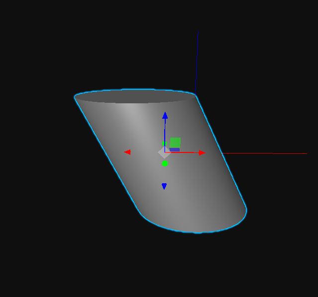
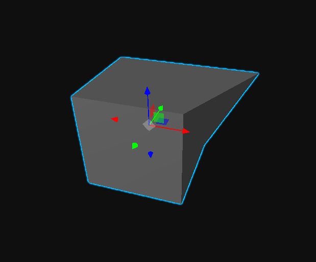

# THREE-BufferGeometry-Modifier
A library for manipulating THREE JS Buffer geometry vertices and geometry groups

# Use
```JavaScript
// ---- SETUP ----
import BufferModifier from './BufferModifier.js'

const g = new THREE.BoxGeometry(1,1,1);
const m = new THREE.MeshBasicMaterial({color:0xffaa00});
const mesh = new THREE.Mesh(g,m);

mesh.modify = new BufferModifier(mesh);
```
```JavaScript
// ---- USE ----
mesh.modify.translateGroup(0, 1);
// translates every vertex in geometry.group[0] along 
//its own normal by 1 unit

mesh.modify.translateGroup(2, 1, new THREE.Vector3(1,0,0));
//translates geometry.group[2] along the positive
//x-axis by 1 unit
```


```JavaScript
mesh.modify.setVertex(0, 0.6, 0.5, 0.5);
// set vertex at geometry.index.array[0]
// at (0.6, 0.5, 0.5) in object space

```

